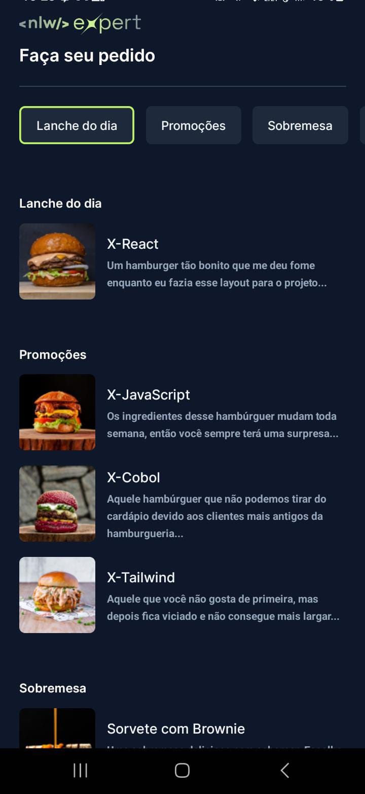

  

Aplicação desenvolvida no NLW Expert da Rocketseat na trilha React Native.

  <a href="#-tecnologias">Tecnologias</a>&nbsp;&nbsp;&nbsp;|&nbsp;&nbsp;&nbsp;
  <a href="#-projeto">Projeto</a>&nbsp;&nbsp;&nbsp;&nbsp;&nbsp;&nbsp;

 

  

## 🚀 Tecnologias

Esse projeto foi desenvolvido com as seguintes tecnologias:

- React Native
- Tailwind Css
- TypeScript

## 💻 Projeto

Foi desenvolvido um aplicado para envio de mensagem para o WhatsApp com o pedido feito pelo usuário no app.